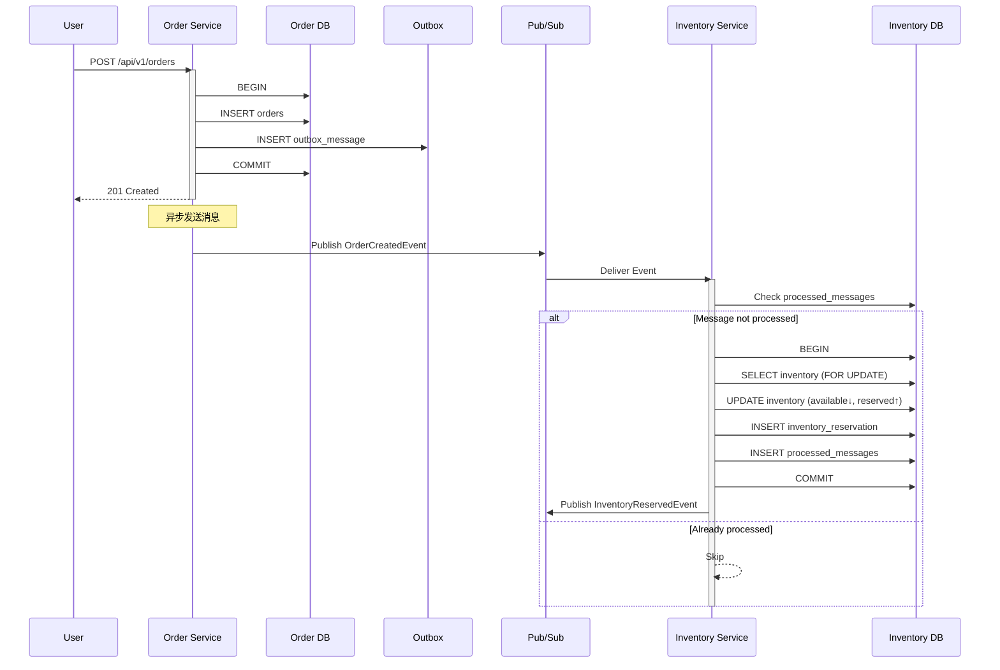
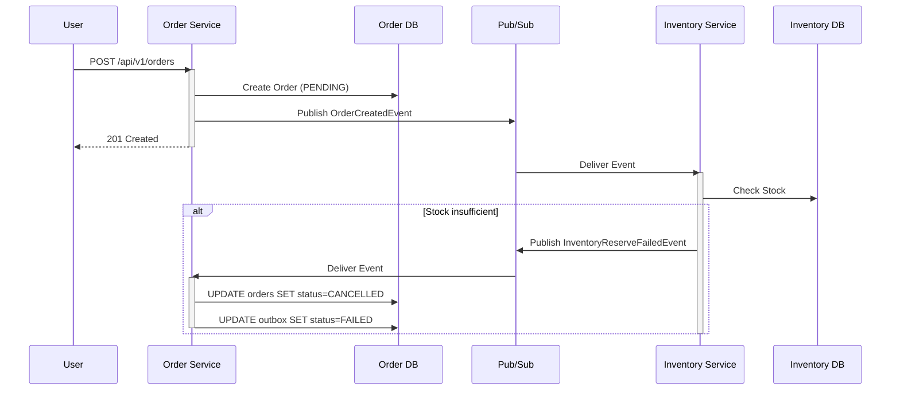

# 库存管理与 Saga 分布式事务设计文档

**日期**: 2026-04-25  
**作者**: Claude Code  
**状态**: 待审核  

---

## 1. 背景与目标

### 1.1 当前系统问题

现有订单系统缺少以下关键能力：

1. **无库存管理** - 创建订单时无法检查库存，可能导致超卖
2. **无分布式事务** - 订单创建和库存扣减无事务保障，可能出现数据不一致
3. **消息可靠性不足** - 消息发送失败仅打印日志，消费端无幂等性保护

### 1.2 设计目标

1. **库存服务独立化** - 创建独立的 Inventory Service 管理库存
2. **预占库存机制** - 创建订单时预占库存，支付成功后确认扣减，取消时释放
3. **Saga 分布式事务** - 使用 Saga 模式保证订单和库存的最终一致性
4. **消息可靠性保障** - 实现消息发送重试、消费幂等、死信队列

---

## 2. 整体架构

```
┌─────────────────────────────────────────────────────────────────────┐
│                          服务架构                                    │
├─────────────────────────────────────────────────────────────────────┤
│                                                                     │
│   ┌──────────────┐     ┌──────────────┐     ┌──────────────┐       │
│   │   Order      │     │   Payment    │     │  Inventory   │       │
│   │   Service    │◄───►│   Service    │     │   Service    │       │
│   │   :8080      │     │   :8081      │     │   :8082      │       │
│   └──────┬───────┘     └──────────────┘     └──────┬───────┘       │
│          │                                          │               │
│          └──────────────┬───────────────────────────┘               │
│                         │                                           │
│              Dapr Pub/Sub (Redis)                                   │
│                                                                     │
└─────────────────────────────────────────────────────────────────────┘

┌─────────────────────────────────────────────────────────────────────┐
│                          事件流                                      │
├─────────────────────────────────────────────────────────────────────┤
│                                                                     │
│  正常流程:                                                          │
│  OrderCreated ──► InventoryReserve ──► InventoryReserved           │
│      │                                       │                      │
│      │                                       ▼                      │
│      │                              OrderStatus=PENDING            │
│      ▼                                                              │
│  OrderPaid ──► InventoryConfirm ──► InventoryConfirmed             │
│      │                                       │                      │
│      │                                       ▼                      │
│      │                              OrderStatus=PAID               │
│      ▼                                                              │
│  OrderCancelled ──► InventoryRelease ──► InventoryReleased         │
│                                                                     │
│  异常流程:                                                          │
│  InventoryReserveFailed ──► OrderCancelled                         │
│                                                                     │
└─────────────────────────────────────────────────────────────────────┘
```

---

## 3. Inventory Service 设计

### 3.1 服务职责

| 功能 | 说明 |
|------|------|
| **基础库存管理** | 查询商品库存、扣减/释放库存、库存变更记录 |
| **预占机制** | 创建订单时预占库存，支付后确认，取消时释放 |
| **防超卖** | 扣减时检查剩余库存，不足时拒绝操作 |
| **库存回补** | 订单取消/退款时自动回补库存 |

### 3.2 数据模型

#### 库存主表 `inventory`

```sql
CREATE TABLE inventory (
    product_id      BIGINT PRIMARY KEY COMMENT '商品ID',
    product_name    VARCHAR(200) NOT NULL COMMENT '商品名称',
    available_stock INT NOT NULL DEFAULT 0 COMMENT '可用库存',
    reserved_stock  INT NOT NULL DEFAULT 0 COMMENT '已预占库存',
    version         INT NOT NULL DEFAULT 0 COMMENT '乐观锁版本号',
    updated_at      DATETIME NOT NULL DEFAULT CURRENT_TIMESTAMP ON UPDATE CURRENT_TIMESTAMP
) ENGINE=InnoDB DEFAULT CHARSET=utf8mb4 COMMENT='库存主表';
```

**说明**:
- `available_stock` = 物理库存 - 预占库存
- `reserved_stock` = 已被订单预占但未确认的数量
- `version` 用于乐观锁防止并发冲突

#### 库存预占记录表 `inventory_reservation`

```sql
CREATE TABLE inventory_reservation (
    id              BIGINT AUTO_INCREMENT PRIMARY KEY,
    order_no        VARCHAR(32) NOT NULL COMMENT '订单号',
    product_id      BIGINT NOT NULL COMMENT '商品ID',
    quantity        INT NOT NULL COMMENT '预占数量',
    status          TINYINT NOT NULL DEFAULT 0 COMMENT '0预占 1已扣减 2已释放',
    created_at      DATETIME NOT NULL DEFAULT CURRENT_TIMESTAMP,
    updated_at      DATETIME NOT NULL DEFAULT CURRENT_TIMESTAMP ON UPDATE CURRENT_TIMESTAMP,
    UNIQUE KEY uk_order_product (order_no, product_id),
    INDEX idx_status (status)
) ENGINE=InnoDB DEFAULT CHARSET=utf8mb4 COMMENT='库存预占记录表';
```

**说明**:
- 追踪每个订单的库存占用状态
- 支持订单多商品场景
- `status`: 0=RESERVED, 1=CONFIRMED, 2=RELEASED

### 3.3 API 设计

| 方法 | 路径 | 说明 |
|------|------|------|
| GET | `/api/v1/inventory/:product_id` | 查询商品库存 |
| POST | `/api/v1/inventory/reserve` | 预占库存（内部事件调用） |
| POST | `/api/v1/inventory/confirm` | 确认扣减（内部事件调用） |
| POST | `/api/v1/inventory/release` | 释放库存（内部事件调用） |
| GET | `/dapr/subscribe` | Dapr 订阅配置 |

---

## 4. Saga 分布式事务设计

### 4.1 核心思想

Saga 模式将长事务拆分为多个本地事务，每个本地事务有对应的补偿操作。如果某个步骤失败，执行已完成的补偿操作回滚。

本项目采用 **编排式 Saga (Choreography Saga)**，通过事件驱动各服务协作。

### 4.2 正常流程

```
┌─────────────────────────────────────────────────────────────────────┐
│                     订单创建 + 库存预占流程                          │
├─────────────────────────────────────────────────────────────────────┤
│                                                                     │
│  1. 用户请求创建订单                                                 │
│         │                                                           │
│         ▼                                                           │
│  2. Order Service:                                                  │
│     ├─ 开启本地事务                                                  │
│     ├─ 创建订单 (status=PENDING)                                    │
│     ├─ 写入 Outbox 消息表                                            │
│     └─ 提交事务                                                      │
│         │                                                           │
│         ▼                                                           │
│  3. 后台任务发送 OrderCreatedEvent                                   │
│         │                                                           │
│         ▼                                                           │
│  4. Inventory Service 接收事件:                                      │
│     ├─ 检查幂等性（是否已处理）                                       │
│     ├─ 开启本地事务                                                  │
│     ├─ 乐观锁检查库存充足？                                           │
│     │      ├─ 是: available↓, reserved↑                             │
│     │      └─ 否: 抛出异常                                           │
│     ├─ 写入预占记录 (status=RESERVED)                                │
│     ├─ 标记消息已处理                                                │
│     └─ 提交事务                                                      │
│         │                                                           │
│    ┌────┴────┐                                                      │
│    ▼         ▼                                                      │
│  成功       失败                                                     │
│    │         │                                                      │
│    ▼         ▼                                                      │
│ 发送        发送                                                     │
│ InvReserved InvReserveFailed                                        │
│ Event       Event                                                   │
│    │         │                                                      │
│    ▼         ▼                                                      │
│  Order    Order                                                     │
│  保持     状态=                                                     │
│  PENDING  CANCELLED                                                 │
│                                                                     │
└─────────────────────────────────────────────────────────────────────┘
```

### 4.3 支付成功流程

```
1. Payment Service: 支付成功
         │
         ▼
2. 发布 OrderPaidEvent
         │
         ▼
3. Order Service: 更新订单状态为 PAID
         │
         ▼
4. 发布 InventoryConfirmEvent
         │
         ▼
5. Inventory Service:
   ├─ 更新预占记录 status=CONFIRMED
   ├─ 实际扣减库存 (reserved↓)
   └─ 发布 InventoryConfirmedEvent
```

### 4.4 取消/超时流程

```
1. 订单取消或超时
         │
         ▼
2. Order Service: 更新订单状态为 CANCELLED
         │
         ▼
3. 发布 InventoryReleaseEvent
         │
         ▼
4. Inventory Service:
   ├─ 更新预占记录 status=RELEASED
   ├─ 释放库存 (available↑, reserved↓)
   └─ 发布 InventoryReleasedEvent
```

### 4.5 异常处理流程

**库存预占失败场景**:

```
1. Inventory Service 预占库存失败
         │
         ▼
2. 发布 InventoryReserveFailedEvent
   {
     "reason": "库存不足" / "系统错误"
   }
         │
         ▼
3. Order Service 接收失败事件:
   ├─ 更新订单状态为 CANCELLED
   ├─ 记录失败原因
   └─ 可选: 通知用户
```

---

## 5. 事件定义

### 5.1 事件 Topic 常量

```go
const (
    // 订单相关 Topic
    TopicOrderCreated           = "order-created"
    TopicOrderPaid              = "order-paid"
    TopicOrderCancelled         = "order-cancelled"
    TopicOrderStatusChanged     = "order-status-changed"
    
    // 库存相关 Topic
    TopicInventoryReserve       = "inventory-reserve"
    TopicInventoryReserved      = "inventory-reserved"
    TopicInventoryReserveFailed = "inventory-reserve-failed"
    TopicInventoryConfirm       = "inventory-confirm"
    TopicInventoryConfirmed     = "inventory-confirmed"
    TopicInventoryRelease       = "inventory-release"
    TopicInventoryReleased      = "inventory-released"
    
    // 死信队列
    TopicDeadLetter             = "dead-letter"
)
```

### 5.2 事件结构定义

```go
// 预占库存请求事件
// 发布者: Order Service
// 订阅者: Inventory Service
type InventoryReserveEvent struct {
    MessageID   string          `json:"message_id"`   // UUID，用于幂等性
    OrderID     int64           `json:"order_id"`
    OrderNo     string          `json:"order_no"`
    UserID      int64           `json:"user_id"`
    Items       []InventoryItem `json:"items"`        // 商品列表
    CreatedAt   time.Time       `json:"created_at"`
}

type InventoryItem struct {
    ProductID   int64  `json:"product_id"`
    ProductName string `json:"product_name"`
    Quantity    int    `json:"quantity"`
}

// 预占成功事件
// 发布者: Inventory Service
// 订阅者: Order Service (可选，用于审计)
type InventoryReservedEvent struct {
    MessageID   string    `json:"message_id"`
    OrderID     int64     `json:"order_id"`
    OrderNo     string    `json:"order_no"`
    ReservedAt  time.Time `json:"reserved_at"`
}

// 预占失败事件
// 发布者: Inventory Service
// 订阅者: Order Service (触发补偿)
type InventoryReserveFailedEvent struct {
    MessageID   string    `json:"message_id"`
    OrderID     int64     `json:"order_id"`
    OrderNo     string    `json:"order_no"`
    Reason      string    `json:"reason"`       // 失败原因
    FailedAt    time.Time `json:"failed_at"`
}

// 确认扣减事件
// 发布者: Order Service
// 订阅者: Inventory Service
type InventoryConfirmEvent struct {
    MessageID   string    `json:"message_id"`
    OrderID     int64     `json:"order_id"`
    OrderNo     string    `json:"order_no"`
    ConfirmedAt time.Time `json:"confirmed_at"`
}

// 确认成功事件
// 发布者: Inventory Service
type InventoryConfirmedEvent struct {
    MessageID   string    `json:"message_id"`
    OrderID     int64     `json:"order_id"`
    OrderNo     string    `json:"order_no"`
    ConfirmedAt time.Time `json:"confirmed_at"`
}

// 释放库存事件
// 发布者: Order Service
// 订阅者: Inventory Service
type InventoryReleaseEvent struct {
    MessageID   string    `json:"message_id"`
    OrderID     int64     `json:"order_id"`
    OrderNo     string    `json:"order_no"`
    Reason      string    `json:"reason"`       // 释放原因
    ReleasedAt  time.Time `json:"released_at"`
}

// 释放成功事件
// 发布者: Inventory Service
type InventoryReleasedEvent struct {
    MessageID   string    `json:"message_id"`
    OrderID     int64     `json:"order_id"`
    OrderNo     string    `json:"order_no"`
    ReleasedAt  time.Time `json:"released_at"`
}

// 死信消息
// 发布者: 各服务
// 订阅者: 监控系统/人工处理
type DeadLetterMessage struct {
    OriginalTopic string          `json:"original_topic"`
    MessageID     string          `json:"message_id"`
    Payload       json.RawMessage `json:"payload"`
    Error         string          `json:"error"`
    FailedCount   int             `json:"failed_count"`
    CreatedAt     time.Time       `json:"created_at"`
}
```

---

## 6. 消息可靠性保障

### 6.1 消息发送端可靠性（Outbox 模式）

**设计目标**: 保证消息至少被发送一次

**实现方案**:

```go
// Outbox 消息表
const (
    MessageStatusPending = "PENDING"
    MessageStatusSent    = "SENT"
    MessageStatusFailed  = "FAILED"
)

type OutboxMessage struct {
    ID        string    `json:"id"`
    Topic     string    `json:"topic"`
    Payload   []byte    `json:"payload"`
    Status    string    `json:"status"`
    RetryCount int      `json:"retry_count"`
    CreatedAt time.Time `json:"created_at"`
    UpdatedAt time.Time `json:"updated_at"`
}

// 发送消息（业务事务中调用）
func (s *OrderService) CreateOrder(ctx context.Context, req *CreateOrderRequest) (*Order, error) {
    tx := s.repo.BeginTransaction()
    defer tx.Rollback()
    
    // 1. 创建订单
    order, err := s.repo.CreateOrder(tx, req)
    if err != nil {
        return nil, err
    }
    
    // 2. 写入 Outbox（和业务操作同一事务）
    event := OrderCreatedEvent{...}
    payload, _ := json.Marshal(event)
    msg := OutboxMessage{
        ID:      generateUUID(),
        Topic:   TopicOrderCreated,
        Payload: payload,
        Status:  MessageStatusPending,
    }
    if err := s.repo.SaveOutboxMessage(tx, msg); err != nil {
        return nil, err
    }
    
    // 3. 提交事务
    if err := tx.Commit(); err != nil {
        return nil, err
    }
    
    // 4. 异步发送（事务提交后才执行）
    go s.publishOutboxMessage(msg)
    
    return order, nil
}

// 异步发送 Outbox 消息
func (s *OrderService) publishOutboxMessage(msg OutboxMessage) {
    maxRetries := 3
    backoff := time.Second
    
    for i := 0; i < maxRetries; i++ {
        err := s.daprClient.PublishEvent(
            context.Background(), 
            "order-pubsub", 
            msg.Topic, 
            msg.Payload,
        )
        
        if err == nil {
            // 发送成功
            s.repo.UpdateOutboxStatus(msg.ID, MessageStatusSent)
            return
        }
        
        // 指数退避重试
        time.Sleep(backoff)
        backoff *= 2
    }
    
    // 最终失败，进入死信队列
    s.repo.UpdateOutboxStatus(msg.ID, MessageStatusFailed)
    s.publishToDeadLetter(msg, "max retries exceeded")
}

// 定时任务：补偿发送 PENDING 消息
func (s *OrderService) ProcessPendingOutbox() {
    // 每 30 秒执行一次
    msgs := s.repo.GetPendingMessages(100)
    for _, msg := range msgs {
        go s.publishOutboxMessage(msg)
    }
}
```

### 6.2 消息消费端幂等性

**设计目标**: 保证同一消息不会重复处理

**实现方案**:

```sql
-- 消息处理记录表
CREATE TABLE processed_messages (
    message_id      VARCHAR(64) PRIMARY KEY COMMENT '消息唯一ID',
    topic           VARCHAR(64) NOT NULL COMMENT '消息主题',
    processed_at    DATETIME NOT NULL DEFAULT CURRENT_TIMESTAMP,
    INDEX idx_processed_at (processed_at)
) ENGINE=InnoDB DEFAULT CHARSET=utf8mb4 COMMENT='已处理消息表';
```

```go
// 消费端处理器
func (h *InventoryHandler) HandleReserve(c *gin.Context) {
    var message DaprPubsubMessage
    if err := c.ShouldBindJSON(&message); err != nil {
        c.JSON(400, dto.Error(1001, err.Error()))
        return
    }
    
    var event InventoryReserveEvent
    if err := decodeEvent(message.Data, &event); err != nil {
        c.JSON(400, dto.Error(1001, err.Error()))
        return
    }
    
    // 1. 幂等性检查
    if h.messageRepo.IsProcessed(event.MessageID) {
        fmt.Printf("message %s already processed, skip\n", event.MessageID)
        c.JSON(200, dto.Success(nil))  // 返回成功，不处理业务
        return
    }
    
    // 2. 开启事务处理业务
    tx := h.repo.BeginTransaction()
    defer tx.Rollback()
    
    // 3. 业务处理：预占库存
    if err := h.service.ReserveInventory(tx, event); err != nil {
        // 发送失败事件
        h.publishReserveFailed(event, err.Error())
        c.JSON(200, dto.Success(nil))  // 返回200避免重试
        return
    }
    
    // 4. 标记消息已处理（和业务同一事务）
    if err := h.messageRepo.MarkProcessed(tx, event.MessageID, TopicInventoryReserve); err != nil {
        c.JSON(500, dto.Error(5000, err.Error()))
        return
    }
    
    // 5. 提交事务
    if err := tx.Commit(); err != nil {
        c.JSON(500, dto.Error(5000, err.Error()))
        return
    }
    
    // 6. 发送成功事件
    h.publishReserved(event)
    
    c.JSON(200, dto.Success(nil))
}
```

### 6.3 死信队列

**设计目标**: 处理最终失败的消息，便于监控和人工介入

**实现方案**:

```go
// 死信消息处理
func (s *Service) publishToDeadLetter(msg OutboxMessage, reason string) {
    dlMsg := DeadLetterMessage{
        OriginalTopic: msg.Topic,
        MessageID:     msg.ID,
        Payload:       msg.Payload,
        Error:         reason,
        FailedCount:   msg.RetryCount,
        CreatedAt:     time.Now(),
    }
    
    s.daprClient.PublishEvent(
        context.Background(),
        "order-pubsub",
        TopicDeadLetter,
        dlMsg,
    )
    
    // 发送告警通知
    s.alertManager.Send(fmt.Sprintf("Message %s failed after max retries", msg.ID))
}

// 定时任务处理死信
func (s *Service) ProcessDeadLetters() {
    // 每小时执行一次
    msgs := s.getDeadLetters(100)
    
    for _, msg := range msgs {
        switch msg.OriginalTopic {
        case TopicInventoryRelease:
            // 库存释放失败可能导致超卖，需要人工介入
            s.sendCriticalAlert(msg)
        case TopicInventoryConfirm:
            // 扣减确认失败，需要检查订单状态
            s.checkOrderAndRetry(msg)
        default:
            // 其他消息，记录日志
            s.logDeadLetter(msg)
        }
    }
}
```

---

## 7. 关键流程时序图

### 7.1 订单创建成功流程



### 7.2 库存不足失败流程



---

## 8. 容错与边界情况

### 8.1 网络分区处理

| 场景 | 处理方案 |
|------|----------|
| Order Service 发送消息失败 | Outbox 模式，定时重试 |
| Inventory Service 处理消息超时 | 返回 200 避免重复消费，但内部标记为失败 |
| 数据库连接中断 | 事务回滚，消息保持 PENDING 状态等待重试 |
| Redis 宕机 | Dapr 使用本地重试，最终写入死信队列 |

### 8.2 数据一致性检查

```go
// 定时对账任务
func (s *Service) ReconcileData() {
    // 每日凌晨执行
    
    // 1. 检查订单状态与库存预占记录不一致
    mismatches := s.findMismatchedOrders()
    for _, m := range mismatches {
        s.fixMismatch(m)
    }
    
    // 2. 检查预占未释放的超时订单
    expired := s.findExpiredReservations()
    for _, e := range expired {
        s.forceRelease(e)
    }
    
    // 3. 发送对账报告
    s.sendReconcileReport()
}
```

---

## 9. 性能考虑

### 9.1 数据库优化

- **索引**: `inventory(product_id)`, `inventory_reservation(order_no, status)`, `processed_messages(message_id)`
- **分区**: `inventory_reservation` 按时间分区，定期归档历史数据
- **连接池**: 每个服务配置合适的数据库连接池大小

### 9.2 消息处理优化

- **批量处理**: Outbox 发送使用批量，减少网络开销
- **并发控制**: 消费端限制并发数，避免数据库压力过大
- **异步处理**: 非关键路径使用异步处理

---

## 10. 部署与运维

### 10.1 新增服务配置

```yaml
# docker-compose.yml 新增 inventory-service
inventory-service:
  build:
    context: .
    dockerfile: inventory-service/Dockerfile
  container_name: oms-inventory-service
  environment:
    APP_PORT: "8082"
    MYSQL_DSN: "root:rootpassword@tcp(mysql:3306)/oms_db?charset=utf8mb4&parseTime=true"
  ports:
    - "8082:8082"
    - "3502:3502"
  networks:
    - oms-network
  depends_on:
    mysql:
      condition: service_healthy
    redis:
      condition: service_healthy

inventory-service-dapr:
  image: daprio/daprd:1.12.0
  container_name: oms-inventory-service-dapr
  command: [
    "./daprd",
    "--app-id", "inventory-service",
    "--app-port", "8082",
    "--dapr-http-port", "3502",
    "--components-path", "/components"
  ]
  volumes:
    - ./components:/components
  network_mode: "service:inventory-service"
```

### 10.2 监控指标

| 指标 | 说明 |
|------|------|
| `order_created_total` | 订单创建总数 |
| `inventory_reserved_total` | 库存预占成功数 |
| `inventory_reserve_failed_total` | 库存预占失败数 |
| `outbox_pending_count` | 待发送消息数 |
| `deadletter_count` | 死信消息数 |
| `reconciliation_mismatch_count` | 数据不一致数 |

---

## 11. 实现顺序建议

1. **Phase 1**: Inventory Service 基础框架 + 数据模型
2. **Phase 2**: 库存预占/确认/释放 API 实现
3. **Phase 3**: 事件订阅与处理
4. **Phase 4**: Saga 流程集成（订单服务调用库存）
5. **Phase 5**: Outbox 模式 + 消息发送可靠性
6. **Phase 6**: 消费端幂等性
7. **Phase 7**: 死信队列 + 监控告警
8. **Phase 8**: 数据对账任务

---

## 12. 设计决策记录

| 决策 | 选项 | 选择 | 理由 |
|------|------|------|------|
| 库存服务模式 | 内置/独立 | 独立 | 符合微服务原则，支持多服务共享库存 |
| 分布式事务 | Saga/TCC/2PC | Saga | 适合长事务，与 Dapr 事件驱动架构契合 |
| 预占机制 | 有/无 | 有 | 防止超卖，支持订单超时释放 |
| 消息可靠性 | Outbox/直接发送 | Outbox | 保证至少一次发送，避免消息丢失 |
| 幂等性实现 | 数据库/Redis | 数据库 | 与业务事务同一事务，一致性好 |

---

## 13. 待确认事项

1. 库存初始数据如何导入？
2. 是否需要库存预警功能（低库存提醒）？
3. 是否需要支持部分商品库存不足时的部分预占？
4. 对账任务的触发频率和告警阈值？

---

## 14. 附录

### 14.1 新增数据库表脚本

```sql
-- 库存主表
CREATE TABLE inventory (
    product_id      BIGINT PRIMARY KEY,
    product_name    VARCHAR(200) NOT NULL,
    available_stock INT NOT NULL DEFAULT 0,
    reserved_stock  INT NOT NULL DEFAULT 0,
    version         INT NOT NULL DEFAULT 0,
    updated_at      DATETIME NOT NULL DEFAULT CURRENT_TIMESTAMP ON UPDATE CURRENT_TIMESTAMP
);

-- 库存预占记录表
CREATE TABLE inventory_reservation (
    id              BIGINT AUTO_INCREMENT PRIMARY KEY,
    order_no        VARCHAR(32) NOT NULL,
    product_id      BIGINT NOT NULL,
    quantity        INT NOT NULL,
    status          TINYINT NOT NULL DEFAULT 0 COMMENT '0预占 1已扣减 2已释放',
    created_at      DATETIME NOT NULL DEFAULT CURRENT_TIMESTAMP,
    updated_at      DATETIME NOT NULL DEFAULT CURRENT_TIMESTAMP ON UPDATE CURRENT_TIMESTAMP,
    UNIQUE KEY uk_order_product (order_no, product_id),
    INDEX idx_status (status)
);

-- 消息处理记录表
CREATE TABLE processed_messages (
    message_id      VARCHAR(64) PRIMARY KEY,
    topic           VARCHAR(64) NOT NULL,
    processed_at    DATETIME NOT NULL DEFAULT CURRENT_TIMESTAMP,
    INDEX idx_processed_at (processed_at)
);

-- Outbox 消息表
CREATE TABLE outbox_messages (
    id              VARCHAR(64) PRIMARY KEY,
    topic           VARCHAR(64) NOT NULL,
    payload         JSON NOT NULL,
    status          VARCHAR(20) NOT NULL DEFAULT 'PENDING',
    retry_count     INT NOT NULL DEFAULT 0,
    created_at      DATETIME NOT NULL DEFAULT CURRENT_TIMESTAMP,
    updated_at      DATETIME NOT NULL DEFAULT CURRENT_TIMESTAMP ON UPDATE CURRENT_TIMESTAMP,
    INDEX idx_status_created (status, created_at)
);
```

---

**文档结束**

请审核此设计文档，如有修改意见请告知。确认无误后，我将进入实施计划阶段。
